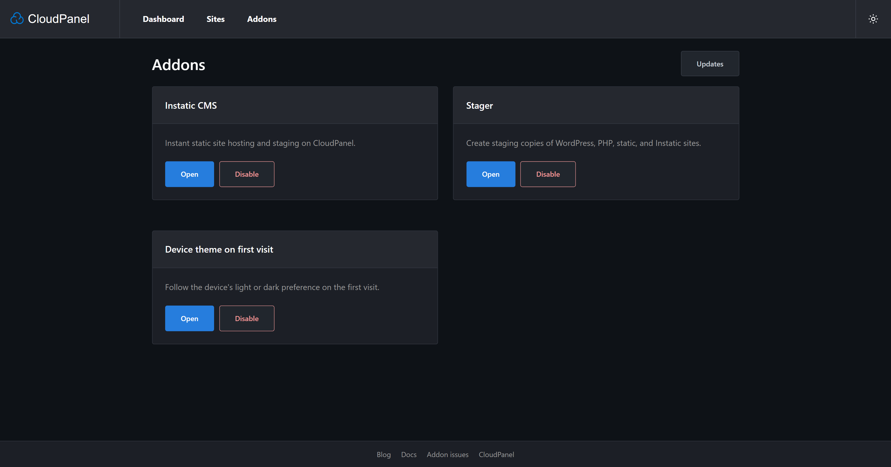

# CloudPanel Addons

Manage Cloudflare-only site access, host Instatic CMS sites, create staging
copies, manage per-site maintenance pages, and set the initial login theme from
the device preference in [CloudPanel](https://www.cloudpanel.io/). Access uses
your existing administrator login.



## Addons

| Addon | Description |
| --- | --- |
| Cloudflare IP Access | Manage “Allow traffic from Cloudflare only” for all sites and enable it automatically for new sites. |
| [Instatic CMS](https://github.com/CoreBunch/Instatic) | Instant static site hosting and staging on CloudPanel. |
| Stager | Create staging copies of WordPress, PHP, static, and Instatic sites. Based on [clp-stager](https://github.com/7heMech/clp-stager). |
| Maintenance Mode | Serve a customizable 503 page per site with instant toggles and IP bypasses. |
| Device theme on first visit | Follow the device's light or dark preference on the first visit to the CloudPanel login page. |

## Install

Run as **root** on an **x86-64 CloudPanel host**:

```bash
curl -fsSL https://github.com/7heMech/cloudpanel-addons/releases/latest/download/install.sh | bash
```

The installer asks which addons to enable. It verifies checksums and build
provenance, and can install Docker when Instatic needs it.

For an unattended Instatic and Stager installation:

```bash
curl -fsSL https://github.com/7heMech/cloudpanel-addons/releases/latest/download/install.sh \
  | bash -s -- --addons=instatic,stager --yes --install-docker
```

Open **Addons** in CloudPanel after installation. Only CloudPanel administrators
can access it.

## Manage

| Command | Purpose |
| --- | --- |
| `clp-addons status` | Check services and CloudPanel integration. |
| `clp-addons install <addon>` | Enable a bundled addon; installs Docker automatically if it's not active yet and the addon needs it. |
| `clp-addons update` | Install the latest verified release. |
| `clp-addons repair` | Restore managed services and CloudPanel integration. |
| `clp-addons maintenance <domain> [on\|off\|status]` | Control or inspect maintenance mode for a site. |
| `clp-addons uninstall <addon> --yes` | Remove an addon and keep its data. |

Addon names are `cloudflare-ips`, `instatic`, `stager`, `maintenance`, and
`login-theme`. Run
`clp-addons --help` for version selection and data removal options.

See [Instatic backup and restore](docs/instatic-backups.md) for CloudPanel Remote
Backups.

## Develop

Requires Bun and ShellCheck.

```bash
bun install
bun run typecheck
bun run test
bun run lint:install
bun run build
```

Run `bun run preview:ui` to preview the interface at
`http://localhost:4100/addons/` with sample data.

Architecture and security choices are indexed in
[Decisions](docs/DECISIONS.md).

## Acknowledgments

Thanks to [@ccMatrix](https://github.com/ccMatrix) for the CloudPanel SSO and
Nginx reverse proxy integration concept.

## License

[Apache-2.0](LICENSE).
