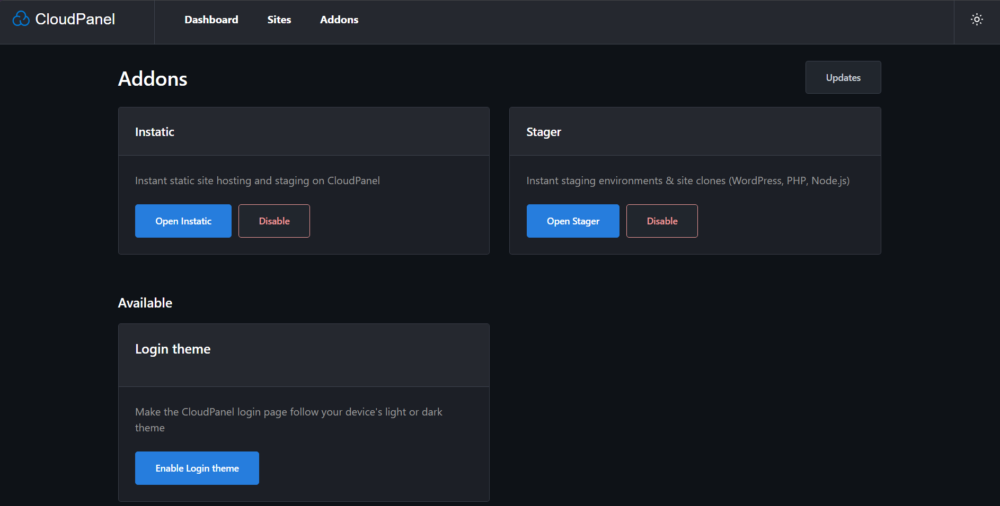

# CloudPanel Addons

Deploy Instatic instances and create staging sites directly in
[CloudPanel](https://www.cloudpanel.io/), using your existing administrator login.



## Addons

| Addon | Description |
| --- | --- |
| [Instatic](https://github.com/CoreBunch/Instatic) | Deploy and manage Docker-based Instatic instances with pinned versions, status, logs, and updates. |
| Stager | Clone PHP, static, and reverse-proxy sites with background jobs and live logs. Based on [clp-stager](https://github.com/7heMech/clp-stager). |

## Installation

Run as **root** on an **x86-64 Linux host with CloudPanel installed**:

```bash
curl -fsSL https://github.com/7heMech/cloudpanel-addons/releases/latest/download/install.sh | bash
```

The installer prompts you to select addons and verifies release checksums and
build provenance. Instatic requires Docker; the installer offers to install it
when needed.

For unattended installation of both addons, including Docker if needed:

```bash
curl -fsSL https://github.com/7heMech/cloudpanel-addons/releases/latest/download/install.sh \
  | bash -s -- --addons=instatic,stager --yes --install-docker
```

After installation, open **Addons** in CloudPanel or append `/addons/` to your
panel URL. Access requires a CloudPanel administrator session.

## Management

Use the manager to enable or disable addons and apply updates. Updates are
applied only when requested.

For command-line management, run as root:

| Command | Purpose |
| --- | --- |
| `clp-addons status` | Check services and panel integration. |
| `clp-addons install <addon>` | Enable a bundled addon. |
| `clp-addons update` | Download, verify, and apply the latest release. |
| `clp-addons repair` | Restore service configuration and panel integration. |
| `clp-addons uninstall <addon> --yes` | Remove an addon while preserving its instance data. |

Replace `<addon>` with `instatic` or `stager`. Use `clp-addons --help` for all
options, including version selection and data removal.

## Development

Requires Bun. The installer lint check also requires ShellCheck.

```bash
bun install
bun run typecheck
bun run test
bun run lint:install
bun run build
```

The build produces `dist/clp-addons-linux-x64`.

To preview the interface, run `bun run preview:ui` and open
`http://localhost:4100/addons/`. The preview uses sample data and does not require
CloudPanel.

See the [design documentation](docs/DECISIONS.md) for architecture, security
details, and known limitations.

## Acknowledgments

Thanks to [@ccMatrix](https://github.com/ccMatrix) for the CloudPanel SSO and
Nginx reverse proxy integration concept.

## License

[Apache-2.0](LICENSE).
